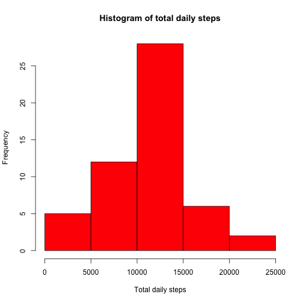
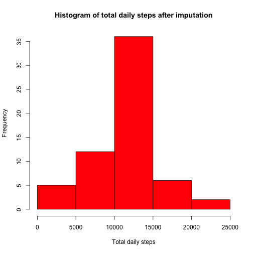
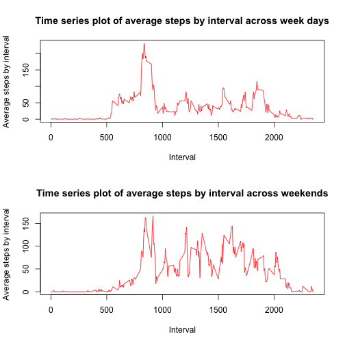

This is an R Markdown document produced for the submission os Peer Assignment #1 for the Coursera course "Reproducible Research". The code chunks for each of the steps mentioned are given below in order


###Loading and preprocessing the data
 

```r
activity <- read.csv("activity.csv")
#Use dplyr for efficiency
library(dplyr)
```

```
## 
## Attaching package: 'dplyr'
## 
## The following objects are masked from 'package:stats':
## 
##     filter, lag
## 
## The following objects are masked from 'package:base':
## 
##     intersect, setdiff, setequal, union
```

```r
act_df <- tbl_df(activity)
#Convert date to a Date field
act_df <- mutate(act_df, Date = as.Date(date))
act_df <- select(act_df, - date)
```

###What is mean total number of steps taken per day?

1. Histogram of the total number of steps taken each day


```r
act_by_day <- group_by(act_df, Date)
sum_by_day <- summarise(act_by_day, daily_steps = sum(steps))
library(datasets)
hist(sum_by_day$daily_steps, main = "Histogram of total daily steps",
         col = "red", xlab = "Total daily steps", ylab = "Frequency")
```

 
 
2. Mean and Median total number of steps taken per day 

```r
mean_daily_steps <- format(mean(sum_by_day$daily_steps, na.rm = T), scientific = F)
median_daily_steps <- median(sum_by_day$daily_steps, na.rm = T)
```

The Mean daily steps is 10766.19
The Median daily steps is 10765

### What is the average daily activity pattern?
1. Time series plot with average number of steps across days:

```r
act_by_intrvl <- group_by(act_df, interval)
avg_by_intrvl <- summarise(act_by_intrvl, avg_intrvl = mean(steps, na.rm = T))
plot(avg_by_intrvl$interval, avg_by_intrvl$avg_intrvl, type = 'l',ylab = "Average steps by interval", xlab = "Intervals", main = "Time series plot of average steps by interval across days")
```

 
2. The 5 minute interval with the maximum average number of steps:

```r
max_avg <- filter(avg_by_intrvl, avg_intrvl == max(avg_intrvl))
```
The maximum average steps taken for an interval across days is 206 steps for the interval 835

###Imputing missing values

1. The total number of missing values in the data set is 2304

2. The 'NA' values in step are replaced by the mean steps for the interval across days
3. New data set with replaced values for NA is created. Steps 2 & 3 is accomplished in the following 
   chunk of code

```r
#Merge with the dataset having average steps by interval
act_df_new <- merge(act_df, avg_by_intrvl, by = "interval")
#replace the steps with NA values with the average value
act_df_new <- act_df_new%>%mutate(steps = ifelse (is.na(steps), round(avg_intrvl), steps))
#drop the column with the averages
act_df_new <- select(act_df_new, -avg_intrvl)
```

4. Histogram with the number of steps taken each day:

```r
#Grouping by day
act_by_day_new <- group_by(act_df_new, Date)
#Summarize by day 
sum_by_day_new <- summarise(act_by_day_new, daily_steps = sum(steps))
#Plot histogram
hist(sum_by_day_new$daily_steps, main = "Histogram of total daily steps after imputation",
         col = "red", xlab = "Total daily steps", ylab = "Frequency")
```

 

```r
#Calculate the mean and median
mean_new <- format(mean(sum_by_day_new$daily_steps, na.rm = T), scientific = F)
median_new <- format(median(sum_by_day_new$daily_steps, na.rm = T), scientific = F)
```

The mean and median has increased after imputation
The Estimate for the the total number of steps daily has also increased after imputation

###Are there differences in activity patterns between weekdays and weekends?

1.The chunk of code below, creates a new factor variable in the dataset with two levels – “weekday” and “weekend” indicating whether a given date is a weekday or weekend day.


```r
#create a factor variable wk_day that separates weekdays and weekends
act_df_week <- act_df_new%>%mutate(wk_day = ifelse (weekdays(Date) %in% c("Sunday", "Saturday"), "Weekend", "Weekday"))
```
 
 

```r
act_df_wkdy <- filter(act_df_week, wk_day == "Weekday")
act_by_intrvl_wkday <- group_by(act_df_wkdy, interval)
avg_by_intrvl_wkday <- summarise(act_by_intrvl_wkday, avg_intrvl = mean(steps, na.rm = T))

act_df_wknd <- filter(act_df_week, wk_day == "Weekend")
act_by_intrvl_wknd <- group_by(act_df_wknd, interval)
avg_by_intrvl_wknd <- summarise(act_by_intrvl_wknd, avg_intrvl = mean(steps, na.rm = T))

par(mfrow = c(2,1))
plot(avg_by_intrvl_wkday$interval, avg_by_intrvl_wkday$avg_intrvl, type = 'l',main = "Time series plot of average steps by interval across week days",
         col = "red", xlab = "Interval", ylab = "Average steps by interval")
plot(avg_by_intrvl_wknd$interval, avg_by_intrvl_wknd$avg_intrvl, type = 'l', main = "Time series plot of average steps by interval across weekends",
         col = "red", xlab = "Interval", ylab = "Average steps by interval")
```

 


